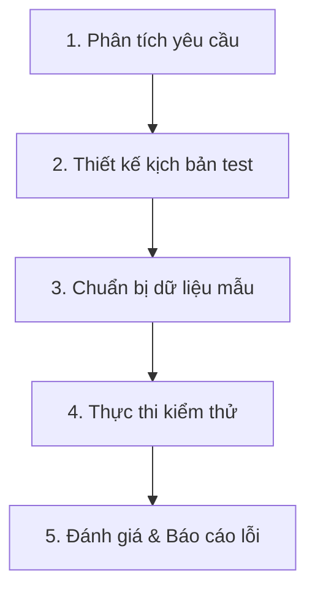

# 🧪 TÀI LIỆU QUY TRÌNH KIỂM THỬ (TEST PLAN & TEST CASES) - PHONEWORLD

Tài liệu này đặc tả quy trình kiểm thử (QA/QC), danh sách các kịch bản kiểm thử (Test Cases) cốt lõi và hướng dẫn thực thi kiểm thử cho hệ thống Thương mại Điện tử PhoneWorld.

---

## I. QUY TRÌNH KIỂM THỬ (TESTING PROCESS)

Quy trình kiểm thử của dự án được xây dựng dựa trên tiêu chuẩn phát triển phần mềm Agile/Scrum, bao gồm 5 giai đoạn chính:



1.  **Phân tích yêu cầu (Requirement Analysis):** Đọc hiểu luồng nghiệp vụ trong tài liệu thiết kế. Xác định phạm vi kiểm thử (tập trung vào các chức năng đặc biệt: Flash Sale, Loyalty Points, Ban Account, Fuzzy Search).
2.  **Thiết kế kịch bản (Test Design):** Thiết lập các bộ Test Cases bao gồm cả kiểm thử luồng đúng (Positive Test) và kiểm thử luồng sai/ngoại lệ (Negative Test).
3.  **Chuẩn bị dữ liệu (Test Data Preparation):** Khởi tạo các tài khoản người dùng thử nghiệm (`user@test.com`, `admin@test.com`) và nạp sản phẩm/danh mục mẫu qua các script seed dữ liệu.
4.  **Thực thi kiểm thử (Test Execution):** 
    *   **Manual Test:** Kiểm thử trực quan trên trình duyệt (http://localhost:3000) đối với các giao diện người dùng và quản trị.
    *   **API Test:** Sử dụng Postman để kiểm tra tính toàn vẹn của các API Endpoints.
5.  **Báo cáo lỗi (Bug Reporting):** Ghi nhận các lỗi phát sinh (nếu có) vào danh sách bug tracking với đầy đủ thông tin: Các bước tái hiện, Kết quả thực tế, Kết quả mong đợi và Ảnh chụp màn hình lỗi.

---

## II. DANH SÁCH KỊCH BẢN KIỂM THỬ (TEST CASES)

### 1. Phân hệ: Xác thực & Khóa tài khoản (Authentication & Ban Account)

| Test Case ID | Tên Kịch Bản | Các Bước Thực Hiện | Kết Quả Mong Đợi (Expected Result) | Trạng Thái |
| :--- | :--- | :--- | :--- | :--- |
| **TC-AUTH-01** | Đăng ký tài khoản mới hợp lệ | 1. Truy cập trang Register<br>2. Nhập đầy đủ thông tin hợp lệ<br>3. Nhấn "Đăng ký" | Hệ thống tạo tài khoản thành công, chuyển hướng đến trang Login và hiển thị thông báo thành công. | Pass |
| **TC-AUTH-02** | Đăng ký với Email đã tồn tại | 1. Nhập email trùng với tài khoản cũ<br>2. Điền các thông tin khác hợp lệ<br>3. Nhấn "Đăng ký" | Hệ thống báo lỗi: "Email đã được sử dụng" hoặc tương đương. Không tạo tài khoản mới. | Pass |
| **TC-AUTH-03** | Đăng nhập tài khoản bị khóa (Ban Account) | 1. Admin thực hiện khóa tài khoản `user@test.com`<br>2. User dùng tài khoản này đăng nhập lại | Đăng nhập thất bại. Hiển thị thông báo bằng tiếng Việt: *"tài khoản của bạn đã bị cấm do có hành vi bất thường. Vui lòng liên hệ hotline để được hỗ trợ"*. | Pass |

---

### 2. Phân hệ: Điểm thưởng & Thành viên (Loyalty Points & Tiers)

| Test Case ID | Tên Kịch Bản | Các Bước Thực Hiện | Kết Quả Mong Đợi (Expected Result) | Trạng Thái |
| :--- | :--- | :--- | :--- | :--- |
| **TC-LOY-01** | Tích điểm tự động khi mua hàng thành công | 1. User mua đơn hàng trị giá 1,000,000đ<br>2. Admin duyệt đơn hàng sang trạng thái "Đã giao hàng" | Hệ thống tự động cộng điểm thưởng vào tài khoản User theo tỷ lệ cấu hình (ví dụ: 10,000đ = 1 điểm -> cộng 100 điểm). | Pass |
| **TC-LOY-02** | Thăng hạng thành viên (Membership Tier Up) | 1. Điểm tích lũy vượt mốc nâng hạng (ví dụ: đạt trên 1000 điểm mốc Bạc)<br>2. Kiểm tra thông tin hạng trên Profile | Hệ thống tự động cập nhật Rank thành viên từ Đồng (Bronze) lên Bạc (Silver). | Pass |
| **TC-LOY-03** | Đổi điểm tích lũy lấy Voucher giảm giá | 1. Truy cập trang đổi quà/ưu đãi<br>2. Chọn đổi Voucher trị giá 50,000đ với 500 điểm thưởng | Điểm thưởng bị trừ 500 điểm. Hệ thống sinh mã Voucher mới áp dụng được trong giỏ hàng. | Pass |

---

### 3. Phân hệ: Chương trình Flash Sale thời gian thực

| Test Case ID | Tên Kịch Bản | Các Bước Thực Hiện | Kết Quả Mong Đợi (Expected Result) | Trạng Thái |
| :--- | :--- | :--- | :--- | :--- |
| **TC-FS-01** | Hiển thị đồng hồ đếm ngược (Countdown) | 1. Vào trang chi tiết sản phẩm đang Flash Sale | Hiển thị đồng hồ đếm ngược thời gian thực (Giờ:Phút:Giây) chính xác đến khi kết thúc đợt sale. | Pass |
| **TC-FS-02** | Áp dụng giá Flash Sale đặc biệt | 1. Thêm sản phẩm đang Flash Sale vào giỏ hàng | Giá của sản phẩm trong giỏ hàng và trang thanh toán phải khớp với giá Flash Sale (đã giảm), không phải giá gốc. | Pass |
| **TC-FS-03** | Giới hạn số lượng mua Flash Sale | 1. Sản phẩm Flash Sale giới hạn tối đa 1 chiếc/người<br>2. User cố tình tăng số lượng lên 2 trong giỏ hàng | Hệ thống chặn và hiển thị cảnh báo: *"Chỉ được mua tối đa 1 sản phẩm này trong đợt Flash Sale"*. | Pass |

---

### 4. Phân hệ: Tìm kiếm mờ (Fuzzy Search)

| Test Case ID | Tên Kịch Bản | Các Bước Thực Hiện | Kết Quả Mong Đợi (Expected Result) | Trạng Thái |
| :--- | :--- | :--- | :--- | :--- |
| **TC-SRCH-01** | Tìm kiếm khi gõ sai chính tả nhẹ | 1. Nhập từ khóa sai ký tự: *"laptp"* hoặc *"iphoen"* vào ô tìm kiếm<br>2. Nhấn tìm kiếm | Hệ thống nhận diện lỗi gõ sai và trả về danh sách các sản phẩm tương ứng: *"laptop"* hoặc *"iphone"*. | Pass |

---

## III. HƯỚNG DẪN THỰC THI KIỂM THỬ (TEST EXECUTION GUIDE)

### Bước 1: Chuẩn bị môi trường & Dữ liệu mẫu (Data Seeding)
Trước khi chạy test, cần chuẩn bị dữ liệu sạch trong Database:
1. Đảm bảo server Backend và Database MongoDB đang chạy.
2. Chạy lệnh tạo dữ liệu mẫu và tài khoản thử nghiệm:
   ```bash
   # Di chuyển vào thư mục backend và chạy script seed dữ liệu
   cd backend
   node seed/seedCategories.js
   node seed/seedTestData.js
   ```

### Bước 2: Thực hiện kiểm thử tự động (Automated Test)
Chạy script kiểm thử tự động để quét nhanh toàn bộ hệ thống API:
```bash
node testAllFeatures.js
```

### Bước 3: Đánh giá kết quả (Test Evaluation)
*   **Đạt (Pass):** Tất cả các bước thực hiện đều cho ra kết quả trùng khớp với "Kết Quả Mong Đợi".
*   **Lỗi (Fail):** Nếu có bất kỳ sự sai lệch nào, ghi nhận lỗi vào file nhật ký lỗi (Bug Log) và chuyển lại cho bộ phận lập trình sửa đổi.
